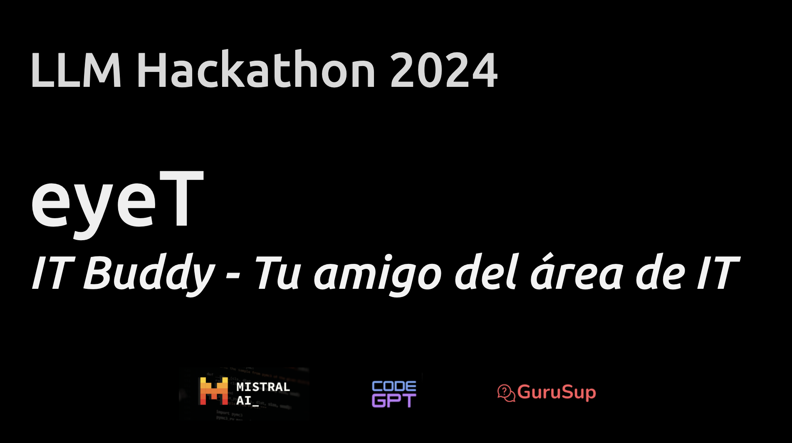
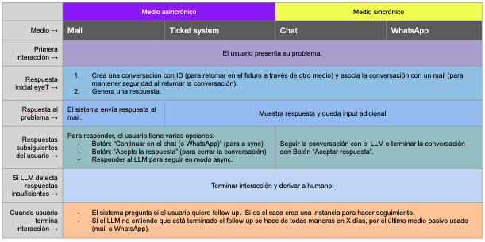
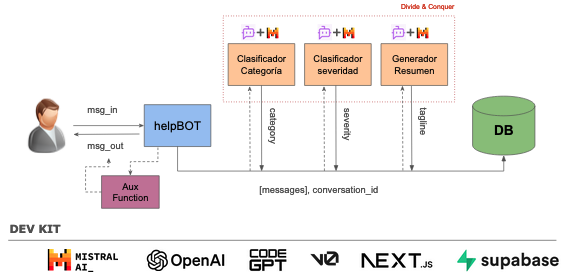
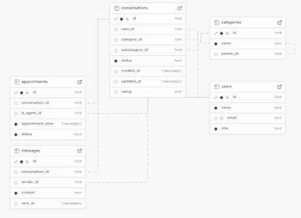

# LLMHackathon Oct 2024


¡Bienvenido a LLMHackathon! Este repositorio contiene el código para el proyecto del hackathon, cuyo objetivo es construir una aplicación web utilizando Next.js y Supabase. El proyecto está diseñado para ser un kit de inicio completo que se puede personalizar y ampliar fácilmente para satisfacer tus necesidades específicas.

## Recursos
- [Demo](https://hackathon-challenge-five.vercel.app/)
- [Presentación en Google Drive](https://docs.google.com/presentation/d/1W6nXt4saOSeVR9OLsrPZaigwJocIxswe5HYfEoh93Ec/edit?usp=sharing)

## Problema
- Un ticket tradicional asíncrono genera mucha ansiedad en el usuario al esperar soluciones.
- Áreas de IT con muy alta demanda normalmente y gran variabilidad de tareas.

## Oportunidad
70% de tickets que recibe un helpdesk de IT en un entorno corporativo son problemas de fácil solución (L1).

Estos incluyen problemas comunes como 
- Reinicio de contraseñas
- Configuración de correo
- Soporte con periféricos.

La mayoría de estas incidencias se pueden resolver rápidamente, generalmente en el primer contacto con el soporte técnico.

## Solución
- ‘guruSup’ para tickets internos de consultas a soporte IT.
- Cambiamos del concepto de ticket a conversación.
   - Una conversación se puede retomar.
   - Una conversación no depende del medio.
- Ofrece soporte en vivo paso a paso.
- Disminuye frustración por el “transfiero a otra área” , tiempo de espera o tiempos lentos de respuesta.

## Flujo


## Esquema de Componentes


## DataBase


# SupportHub: Next.js and Supabase Starter Kit

Welcome to SupportHub, a robust starter kit designed to accelerate your development process with Next.js and Supabase. This project is the fastest way to build modern web applications, leveraging the power of Next.js's App Router and Supabase's real-time capabilities.

## Features

- **Full Next.js Stack**: Seamlessly integrates with the entire Next.js ecosystem, including App Router, Pages Router, Middleware, Client, and Server components.
- **Supabase SSR**: Utilizes Supabase's server-side rendering capabilities with cookie-based authentication for a seamless user experience.
- **Tailwind CSS**: Styled with Tailwind CSS for rapid UI development and customization.
- **Shadcn UI Components**: Includes a set of pre-built UI components from Shadcn UI for consistent design and functionality.
- **Vercel Deployment**: Easily deploy your application to Vercel with automatic environment variable configuration.

## Getting Started

To get started with SupportHub, follow these steps:

1. **Create a Supabase Project**: Set up your Supabase project via the [Supabase dashboard](https://database.new).
2. **Initialize the Next.js App**: Use the Supabase Starter template with the following command:
   ```bash
   npx create-next-app -e with-supabase
   ```
3. **Configure Environment Variables**: Rename `.env.example` to `.env.local` and update it with your Supabase project URL and API key.
4. **Run the Development Server**: Start the Next.js development server with:
   ```bash
   npm run dev
   ```

## Deployment

Deploy your application to Vercel with a single click. The deployment process will guide you through creating a Supabase account and project, and automatically configure the necessary environment variables.

## Feedback and Issues

We welcome your feedback and issues. Please file them on the [Supabase GitHub repository](https://github.com/supabase/supabase/issues/new/choose).

## More Supabase Examples

Explore more examples and resources to enhance your development with Supabase and Next.js:

- [Next.js Subscription Payments Starter](https://github.com/vercel/nextjs-subscription-payments)
- [Cookie-based Auth and the Next.js 13 App Router (free course)](https://youtube.com/playlist?list=PL5S4mPUpp4OtMhpnp93EFSo42iQ40XjbF)
- [Supabase Auth and the Next.js App Router](https://github.com/supabase/supabase/tree/master/examples/auth/nextjs)

## License

This project is licensed under the MIT License.